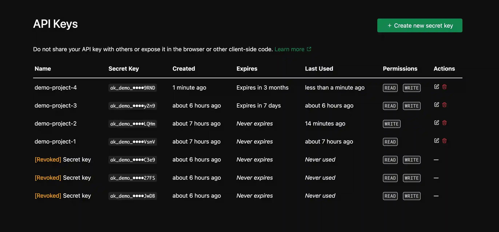
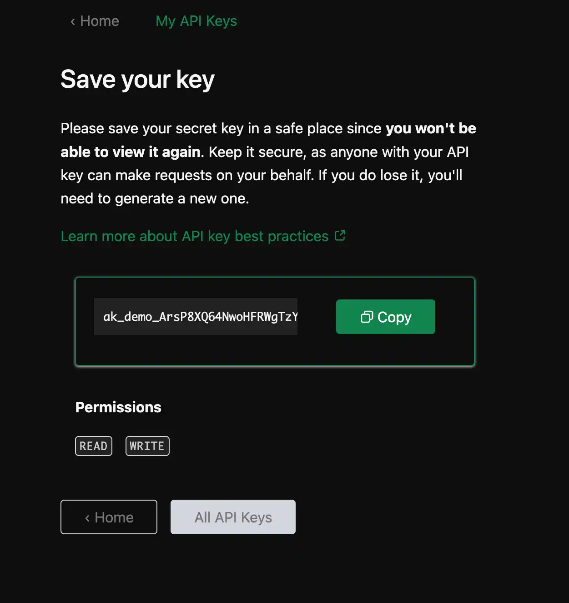
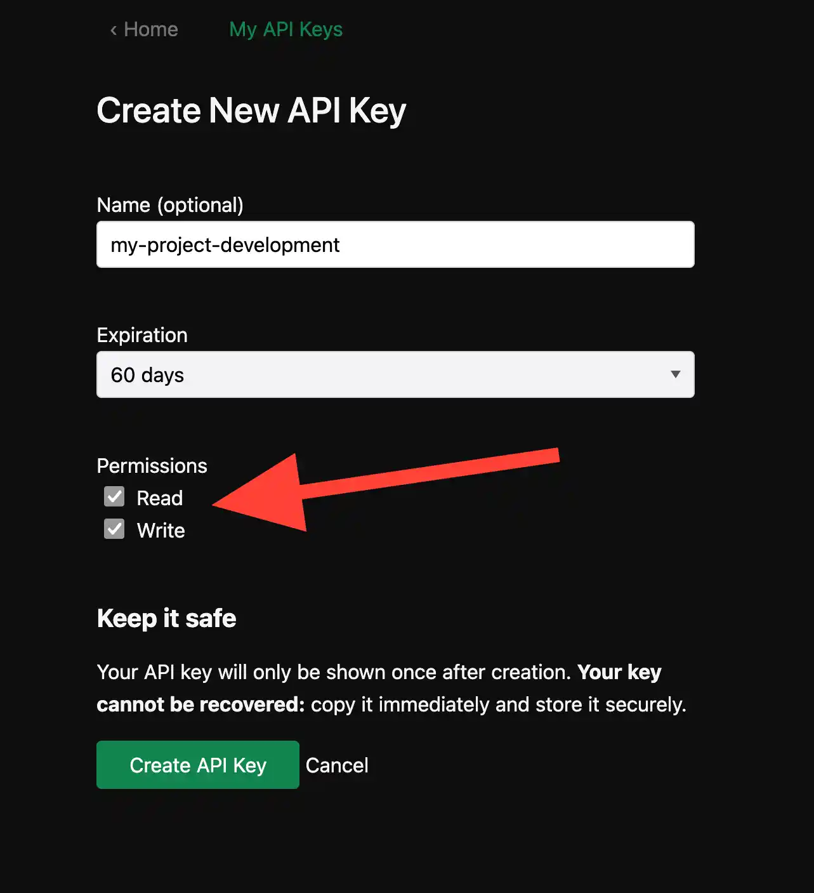

# 🔑 `api_keys` – Protect your Rails API with secure, self-serve API keys

[](https://badge.fury.io/rb/pay)

`api_keys` makes it simple to add secure, production-ready API key authentication to any Rails app. Generate keys, restrict scopes, auto-expire tokens, revoke tokens. It also provides a self-serve dashboard for your users to self-issue and manage their API keys themselves. All tokens are hashed securely by default, and never stored in plaintext.

[ 🟢 [Live interactive demo website](https://apikeys.rameerez.com) ]



Check out my other 💎 Ruby gems: [`allgood`](https://github.com/rameerez/allgood) · [`usage_credits`](https://github.com/rameerez/usage_credits) · [`profitable`](https://github.com/rameerez/profitable) · [`nondisposable`](https://github.com/rameerez/nondisposable)

## Installation

Add this line to your application's Gemfile:

```ruby
gem "api_keys"
```

And then `bundle install`. After the gem is installed, run the generator and migration:

```bash
rails g api_keys:install
rails db:migrate
```

And you're done!

## Quick Start

Just add `has_api_keys` to your desired model. For example, if you want your `User` records to have API keys, you'd have:

```ruby
class User < ApplicationRecord
  has_api_keys
end
```

You can also customize how many maximum keys your users can have by passing a block to `has_api_keys`, like this:

```ruby
class User < ApplicationRecord
  has_api_keys do
    max_keys 10 # only 10 active API keys per user allowed
    require_name true # always require users to set a name for each API key
  end
end
```

It'd work the same if you want your `Organization` or your `Project` records to have API keys.

### Mount the dashboard engine

The goal of `api_keys` is to allow you to turn your Rails app into an API platform with secure key authentication in minutes, as in: drop in this gem and you're pretty much done.

To achieve that, the gem provides a ready-to-go dashboard you can just mount in your `routes.rb` like this:

```ruby
mount ApiKeys::Engine => '/settings/api-keys'
```

Now your users can:
- self-issue new API keys
- set expiration dates
- attach scopes / permissions to individual keys
- add and edit the key names
- revoke instantly
- see the status of all their keys

It provides an UI with everything you'd expect from an API keys dashboard, working right out of the box:



To make the experience between your app and the `api_keys` dashboard more seamless, you can configure a `return_url` and `return_text` so your users can quickly go back to your app or settings page (in the screenshot above, that's the "Home" links, text customizable)

You can check out the dashboard on the [live demo website](https://apikeys.rameerez.com).


## How it works

### Issuing new API keys

If you want to write your own front-end instead of using the provided dashboard, or just want to issue API keys at any point, you can do it with `create_api_key!`:

```ruby
@api_key = @user.create_api_key!(
  name: "my-key",
  scopes: "['read', 'write']",
  expires_at: 42.days.from_now
)

# Get the plaintext token only available upon creation
plaintext_token = @api_key.token
# => ak_123abc...
```

For security reasons, the **gem does not store the generated key** in the database.

We only store a salted hash, so the API key / API token itself is only available in plaintext immediately after creation, as `@api_key.token` – the `.token` method won't work any other time.

With this token, your users can make calls to your endpoints by attaching it as an `"Authorization: Bearer ak_123abc..."` in their HTTP calls headers, like this:

```bash
curl -X GET -H "Authorization: Bearer ak_123abc..."   "http://example.com/api/endpoint"
```

### Listing all keys for users

Of course, you can list all API keys for any record like this:
```ruby
  @user.api_keys
```

You can filter by active keys, expired keys, revoked keys:
```ruby
  @user.api_keys.active
  @user.api_keys.expired
  @user.api_keys.revoked
  @user.api_keys.inactive # expired or revoked
```

### Useful API key methods

Check if an API key is still active and therefore allowed to perform actions:
```ruby
@api_key.active?
# => true
```

Or expired:
```ruby
@api_key.expired?
# => false
```

You can revoke (disable, make inactive) any API key at any point like this:
```ruby
@api_key.revoke!
```

And you can check if an API key is revoked like this:
```ruby
@api_key.revoked?
# => true
```

And for any API key, you can always display a safe, user-friendly masked token to display on user interfaces so users can easily identify their keys:
```ruby
@api_key.masked_token
# => "ak_demo_••••yZn9"
```

### Scopes: define and verify API Key permissions

Users can limit what each API key does by selecting scopes, and you can define those scopes.

In the `config/initializers/api_keys.rb` initializer generated when you installed the gem, you'll find an option to define global scopes:
```ruby
config.default_scopes = ["read", "write"]
```

These will be the available permissions you'll see, for example, in the API Keys dashboard:



You can also define per-model scopes by passing the option to the `has_api_keys` block, which overrides global defaults:

```ruby
class User < ApplicationRecord
  has_api_keys do
    max_keys 10
    default_scopes %w[read write admin]
  end
end
```

You can get as granular with your scopes as you'd like, think for example AWS-like strings of the form: `"s3:GetObject"` – how you set this up is up to you! Scopes take any string: we recommend sticking to simple verbs (`"read"`, `"write"`) or `"resource:action"` (case-sensitive!)

You can check if an API key is allowed to do actions by checking its scopes:
```ruby
@api_key.allows_scope?("read")
# => true
```

## Controllers: secure your API endpoints

To add the `api_keys` functionality to your controllers, just use the `ApiKeys::Controller` concern and you'll have all controller methods available:
```ruby
class ApiController < ApplicationController
  include ApiKeys::Controller # provides authenticate_api_key! and current_api_key_owner
end
```

With this, you get the `authenticate_api_key!` and `current_api_key_owner` methods, which come in handy to build your key-gated actions.

### Require an API key for an endpoint

If you just want to check the presence of a valid (active, non-expired, non-revoked) API key for an endpoint, you can do:

```ruby
before_action :authenticate_api_key!
```

And of course, if you want to have unauthenticated endpoints:

```ruby
before_action :authenticate_api_key!, except: [:unauthenticated_endpoint]
```

`authenticate_api_key!` will return `401 Unauthenticated` for anything that's not a valid API key.

It will also load the valid API key, if any, to a `current_api_key` variable, that returns an API Key object (`ApiKeys::ApiKey`) on which you can call all the methods we've outlined above, and access any attribute, like:

```ruby
current_api_key.expires_at
# => 2025-05-25 05:25:05.250525000 UTC +00:00
```

If the API key has an owner, you can also access it either with `current_api_key.owner` or with the helper method `current_api_key_owner`

For example, if the owner of the API key is a `User`, you might do something like:
```ruby
current_api_key_owner.email
# => john.doe@example.com
```

### Require a scope for an endpoint

You can require a specific scope for any endpoint like:
```ruby
authenticate_api_key!(scope: "write")
```

It may be cleaner if you pass it as a Proc to `before_action` – and it may result in better-organized code if you do it endpoint-per-endpoint, immediately before each method definition, like this:

```ruby
before_action -> { authenticate_api_key!(scope: "write") }, only: [:write_action]
def write_action
  # We'll only get here if the API key is active AND it has the right scope, so execute the actual logic of the endpoint and return success:
  render json: {
    # Your success JSON...
  }, status: :ok
end
```

### Rate limit your API endpoints

Rails 8 introduced the native, built-in `rate_limit` to easily rate limit your endpoints, so `Rack::Attack` is no longer necessary! While this is not an `api_keys` feature per se, I thought it'd be nice to include an example here because it pairs so well with `api_keys`.

For example, if you want to rate limit an endpoint to only accept 2 requests each 10 seconds, per API key, you'd do something like:
```ruby
before_action -> { authenticate_api_key! }, only: [:rate_limited_action]
rate_limit to: 2, within: 10.seconds,
            by: -> { current_api_key&.id }, # Limit per API key ID
            with: -> { render json: { error: "rate_limited", message: "Too many requests (max 2 per 10 seconds per key). Please wait." }, status: :too_many_requests },
            only: [:rate_limited_action]
def rate_limited_action
  render json: {
    # Success JSON
  }, status: :ok
end
```

This `rate_limit` feature depends on Rails 8+ and an active, well-configured cache store, like [`solid_cache`](https://github.com/rails/solid_cache), which comes by default in Rails 8.

If you're still on early versions of Rails, you can still use `api_keys`! No need to implement `rate_limit` – just an idea if you're already on Rails 8!


## Configuration and settings

The gem installation creates an initializer at `config/initializers/api_keys.rb`

The default initializer is self-explanatory and self-documented, please consider spending a bit of time reading through it if you want to fine-tune the gem.

Some highlights:

### Accept API keys via query params instead of Authentication HTTP headers

By default, the `api_key` gem expects API keys to come *exclusively* as HTTP Authentication Bearer tokens, for security purposes. But you can allow users to make requests to your endpoints with the API key token passed as a URL query param too, like this:

```
https://example.com/api/endpoint?api_key=ak_123abc...
```

This is not recommended security-wise because you'll be leaking API tokens everywhere in your logs, but if you want to enable this, just set the query param name you're expecting the API key token to be in:

```ruby
config.query_param = "api_key"
```

### Changing the hashing function to `bcrypt` for maximum security

By default, the `api_keys` gem hashes tokens using `sha256`, for fast token lookup and low-latency API authentication. Tokens are salted via their prefix, and only stored as secure digests.

If you need slower, password-grade hashing (e.g., for extremely sensitive tokens), you can switch to bcrypt:

```ruby
config.hash_strategy = :bcrypt
```

Note: bcrypt is ~50–100x slower than SHA256. For most API use cases, sha256 is more than sufficient.

`sha256` has O(1) lookup, `bcrypt` doesn't. This means that if you switch to `bcrypt`, you may observe ~100ms lags on every API call, for every token auth that's not cached.

For 99% of APIs, `sha256` is more than secure enough — and far better for performance.

### Increase cache TTL

We cache token lookups to improve performance, especially for repeated requests. This keeps `bcrypt` and `sha256` strategies fast under load.

By default, we use a 5-second TTL, which offers a strong balance: most requests benefit from caching, while revoked keys stop working almost immediately.

If security is your top priority (e.g. rapid revocation after suspected key compromise), you can disable caching entirely:

```ruby
config.cache_ttl = 0.seconds # disables caching
```

If performance matters more than real-time revocation, increase the TTL to reduce DB hits:

```ruby
config.cache_ttl = 2.minutes # boosts performance at cost of slower revocation
```

⚠️ Security note: Revoked keys may remain valid for up to cache_ttl. For strict real-time revocation, set cache_ttl = 0.


## Callbacks: analytics, logging, usage monitoring & auditing

The gem offers two callbacks that get executed every single time an API key is checked and authenticated (through `authenticate_api_key!` in controllers, for example)

You can define logic for them:
```ruby
config.before_authentication = ->(request) { Rails.logger.info "Authenticating request: #{request.uuid}" }

config.after_authentication = ->(result) { MyAnalytics.track_auth(result) }
```

This is especially useful if you want to build custom monitoring, usage tracking or auditing systems on top of the `api_keys` gem.

Since these callbacks get called every single time an endpoint request is made, we can't just execute the code synchronously, blocking the thread and making the endpoint lag. Instead, we enqueue an async job that process the callback code, however long it is. You can configure which queue these jobs get enqueued to.

The downside of this, of course, is that callbacks will only work if you have a valid, well-configured Active Job backend for your Rails app, like Sidekiq or [`solid_queue`](https://github.com/rails/solid_queue/), which comes by default in Rails 8. If Active Job is not well configured, well, your callbacks just won't get executed.

There's also a `track_requests_count` config option that you can turn on so the gem keeps track of how many requests has each API key made. When this is on, you may access the count like this:
```ruby
@api_key.requests_count
# => 4567
```

But again, this is turned off by default for performance purposes, and depends on having a working, well-configured Active Job backend.

## Enterprise-ready by design
The `api_keys` gem ships with:

 - Flexible storage
 - Async hooks
 - ActiveJob support
 - Polymorphic ownership (User, Org, etc.)
 - Custom scopes
 - Production caching
 - Tracking of last time each key was used
 - Usage tracking
 - SHA256 fallback

Making it enterprise-ready, built with extensibility and compliance in mind.

## Roadmap
  - [ ] Automatic rotation policy helpers
  - [ ] Key-pair / HMAC option

## Demo Rails app

There's a demo Rails app showcasing the features in the `api_keys` gem under `test/dummy`. It's currently deployed to `apikeys.rameerez.com`. If you want to run it yourself locally, you can just clone this repo, `cd` into the `test/dummy` folder, and then `bundle` and `rails s` to launch it. You can examine the code of the demo app to better understand the gem.

## Testing

Run the test suite with `bundle exec rake test`

## Development

After checking out the repo, run `bin/setup` to install dependencies. Then, run `rake spec` to run the tests. You can also run `bin/console` for an interactive prompt that will allow you to experiment.

To install this gem onto your local machine, run `bundle exec rake install`.

## Contributing

Bug reports and pull requests are welcome on GitHub at https://github.com/rameerez/api_keys. Our code of conduct is: just be nice and make your mom proud of what you do and post online.

## License

The gem is available as open source under the terms of the [MIT License](https://opensource.org/licenses/MIT).
