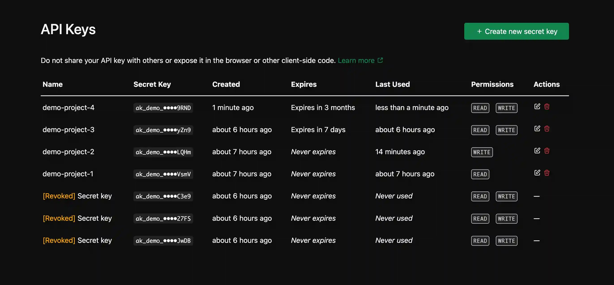
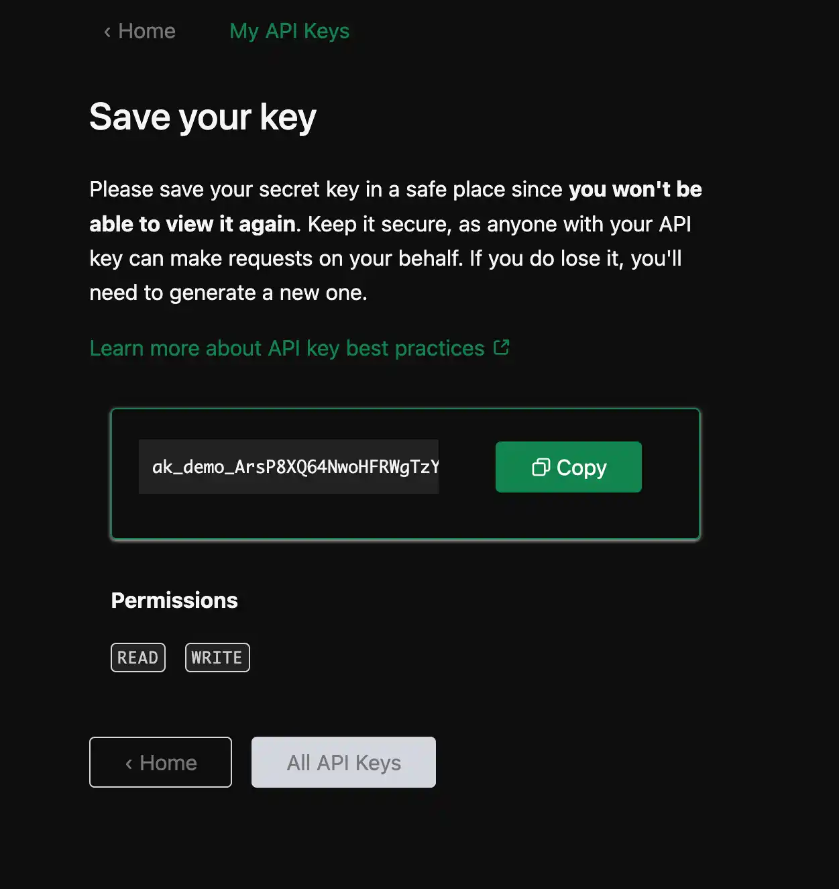
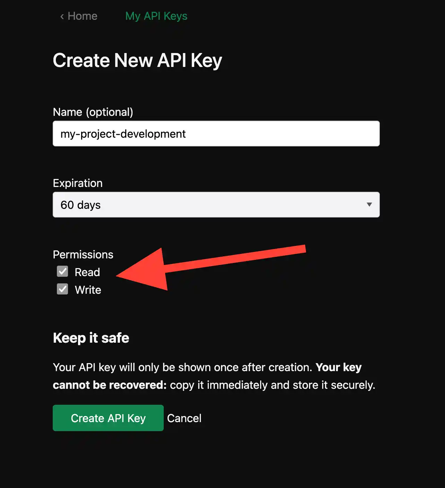

# 🔑 `api_keys` – Secure API keys for your Rails app

[](https://badge.fury.io/rb/api_keys) [](https://github.com/rameerez/api_keys/actions)

> [!TIP]
> **🚀 Ship your next Rails app 10x faster!** I've built **[RailsFast](https://railsfast.com/?ref=api_keys)**, a production-ready Rails boilerplate template that comes with everything you need to launch a software business in days, not weeks. Go [check it out](https://railsfast.com/?ref=api_keys)!

`api_keys` makes it simple to add secure, production-ready API key authentication to any Rails app. Generate keys, restrict scopes, auto-expire tokens, revoke tokens, and gate endpoints. It also provides a self-serve dashboard for users to issue and manage their own API keys. Secret tokens are hashed and shown only once. Plaintext is stored only for a key type that you explicitly mark as public, non-revocable, and limited to a finite permission set.

[ 🟢 [Live interactive demo website](https://apikeys.rameerez.com) ]



Check out my other 💎 Ruby gems: [`allgood`](https://github.com/rameerez/allgood) · [`usage_credits`](https://github.com/rameerez/usage_credits) · [`profitable`](https://github.com/rameerez/profitable) · [`nondisposable`](https://github.com/rameerez/nondisposable)

## Installation

Add this line to your application's Gemfile:

```ruby
gem "api_keys"
```

And then `bundle install`. After the gem is installed, run the generator and migration:

```bash
rails g api_keys:install
rails db:migrate
```

And you're done!

### Upgrading an existing installation

Install the bounded bcrypt authentication lookup index before deploying the current hardening changes:

```bash
rails generate api_keys:add_authentication_index
rails db:migrate
```

The generated migration is idempotent and uses a concurrent PostgreSQL index where supported.

## Quick Start

Just add `has_api_keys` to your desired model. For example, if you want your `User` records to have API keys, you'd have:

```ruby
class User < ApplicationRecord
  has_api_keys
end
```

You can also customize how many maximum keys your users can have by passing a block to `has_api_keys`, like this:

```ruby
class User < ApplicationRecord
  has_api_keys do
    max_keys 10 # only 10 active API keys per user allowed
    require_name true # always require users to set a name for each API key
  end
end
```

It'd work the same if you want your `Organization` or your `Project` records to have API keys.

### Mount the dashboard engine so your users can self-serve API keys

The goal of `api_keys` is to allow you to turn your Rails app into an API platform with secure key authentication in minutes, as in: drop in this gem and you're pretty much done with API key management.

To achieve that, the gem provides a ready-to-go dashboard you can just mount in your `routes.rb` like this:

```ruby
mount ApiKeys::Engine => '/settings/api-keys'
```

#### Default behavior (User-owned keys)

By default, the dashboard expects:
- A `current_user` method that returns the currently logged-in user
- An `authenticate_user!` method that ensures a user is logged in

This works out-of-the-box with Devise and most authentication solutions where `User` owns the API keys.

#### Custom owner models (Organization, Team, etc.)

If your API keys belong to a different model (e.g., `Organization`), you **must** configure the dashboard in your initializer:

```ruby
# config/initializers/api_keys.rb
ApiKeys.configure do |config|
  # Tell the dashboard how to find the current API key owner
  config.current_owner_method = :current_organization
  
  # Tell the dashboard how to ensure the owner is authenticated
  config.authenticate_owner_method = :authenticate_organization!
end
```

These methods must exist in your `ApplicationController` (or wherever the engine is mounted). For example:

```ruby
class ApplicationController < ActionController::Base
  def current_organization
    # Your logic to return the current organization
    @current_organization ||= Organization.find(session[:organization_id])
  end
  
  def authenticate_organization!
    redirect_to login_path unless current_organization
  end
end
```

#### Common scenarios

**Organization with user membership:**
```ruby
# When organizations own keys but users manage them
config.current_owner_method = :current_organization
config.authenticate_owner_method = :require_organization_member!
```

**Multi-tenant applications:**
```ruby
# When each tenant/account owns keys
config.current_owner_method = :current_account
config.authenticate_owner_method = :authenticate_account!
```

**Team-based ownership:**
```ruby
# When teams own keys
config.current_owner_method = :current_team  
config.authenticate_owner_method = :ensure_team_access!
```

#### What the dashboard provides

Once configured, your users can:
- self-issue new API keys
- set expiration dates
- attach scopes / permissions to individual keys
- add and edit the key names
- revoke instantly
- see the status of all their keys

It provides an UI with everything you'd expect from an API keys dashboard, working right out of the box:



To make the experience between your app and the `api_keys` dashboard more seamless, you can configure a `return_url` and `return_text` so your users can quickly go back to your app or settings page (in the screenshot above, that's the "Home" links, text customizable)

You can check out the dashboard on the [live demo website](https://apikeys.rameerez.com).

### Customizing the Dashboard

The gem provides two levels of customization for the mounted dashboard:

#### Level 1: Use the stock dashboard (default)
Works out of the box with good defaults. No configuration needed.

#### Level 2: Override CSS variables
Tweak colors and spacing by overriding CSS variables in your application's stylesheet:

```css
:root {
  --api-keys-primary-color: #your-brand-color;
  --api-keys-danger-color: #dc3545;
  --api-keys-success-color: #28a745;
  --api-keys-badge-secret-bg: #e7f1ff;
  --api-keys-badge-publishable-bg: #fef3cd;
  /* See layout file for all available variables */
}
```

#### Building Custom Integrations

If you need complete control over the UI (e.g., to match your design system with Tailwind, Bootstrap, etc.), you can build your own views and controllers while using the gem's model layer and helpers.

The gem provides a comprehensive set of helpers specifically designed for custom integrations. These patterns are battle-tested from real production integrations.

##### What You'll Need

A complete custom integration typically requires:

| Component | Purpose |
|-----------|---------|
| Initializer | Configure the gem + opt into form helpers |
| Routes | RESTful resources (~6 lines) |
| Controller | Handle CRUD operations (~90 lines) |
| Views | index, new, edit, success pages |
| Helper include | One line in ApplicationHelper |

##### Quick Setup

**1. Initializer** (`config/initializers/api_keys.rb`):

```ruby
# Include form builder extensions for cleaner forms
Rails.application.config.to_prepare do
  ActionView::Helpers::FormBuilder.include(ApiKeys::FormBuilderExtensions)
end

ApiKeys.configure do |config|
  config.current_owner_method = :current_organization
  config.authenticate_owner_method = :authenticate_organization!
  # ... other config
end
```

**2. Routes** (`config/routes.rb`):

```ruby
namespace :settings do
  resources :api_keys, only: [:index, :new, :create, :edit, :update] do
    post :revoke, on: :member
    get :success, on: :collection
    post :create_publishable, on: :collection  # If using key types
  end
end
```

**3. Helper** (`app/helpers/application_helper.rb`):

```ruby
module ApplicationHelper
  include ApiKeys::ViewHelpers
end
```

**4. Controller** - See the complete example below.

---

### Complete Controller Example

Here's a production-ready controller (~90 lines) that handles all API key operations:

```ruby
# app/controllers/settings/api_keys_controller.rb
module Settings
  class ApiKeysController < ApplicationController
    before_action :set_api_key, only: [:edit, :update, :revoke]
    before_action :set_available_scopes, only: [:new, :create, :edit, :update]

    def index
      @publishable_key = current_organization.api_keys.publishable.active.first
      @secret_keys = current_organization.api_keys.secret.active.order(created_at: :desc)
      @inactive_keys = current_organization.api_keys.secret.inactive.order(created_at: :desc)
    end

    def new
      @api_key = current_organization.api_keys.build(key_type: :secret)
    end

    def create
      @api_key = current_organization.create_api_key!(
        name: api_key_params[:name],
        key_type: :secret,
        scopes: api_key_params[:scopes],
        expires_at_preset: params.dig(:api_key, :expires_at_preset)
      )

      ApiKeys::TokenSession.store(session, @api_key)
      redirect_to success_settings_api_keys_path
    rescue ActiveRecord::RecordInvalid => e
      @api_key = e.record
      flash.now[:alert] = "Failed to create API key."
      render :new, status: :unprocessable_entity
    end

    def success
      @token = ApiKeys::TokenSession.retrieve_once(session, api_key: @api_key)
      redirect_to settings_api_keys_path, alert: "Token can only be shown once." and return if @token.blank?
    end

    def edit
    end

    def update
      if @api_key.update(api_key_params)
        redirect_to settings_api_keys_path, notice: "API key updated."
      else
        flash.now[:alert] = "Failed to update API key."
        render :edit, status: :unprocessable_entity
      end
    end

    def create_publishable
      unless current_organization.can_create_api_key?(key_type: :publishable)
        redirect_to settings_api_keys_path, alert: "You already have a publishable key."
        return
      end

      current_organization.create_api_key!(name: "SDK Key", key_type: :publishable)
      redirect_to settings_api_keys_path, notice: "Publishable key created!"
    rescue ActiveRecord::RecordInvalid => e
      redirect_to settings_api_keys_path, alert: "Failed to create key."
    end

    def revoke
      if @api_key.revocable?
        @api_key.revoke!
        redirect_to settings_api_keys_path, notice: "API key revoked."
      else
        redirect_to settings_api_keys_path, alert: "This key cannot be revoked."
      end
    end

    private

    def set_api_key
      @api_key = current_organization.api_keys.find(params[:id])
    end

    def set_available_scopes
      @available_scopes = current_organization.available_api_key_scopes
    end

    def api_key_params
      params.require(:api_key).permit(:name, scopes: [])
    end
  end
end
```

---

### Model Scopes

Filter keys by type and status:

```ruby
# By key type (when using key_types feature)
@org.api_keys.publishable          # Only publishable keys
@org.api_keys.secret               # Secret keys (and legacy keys without type)

# By status
@org.api_keys.active               # Not revoked and not expired
@org.api_keys.inactive             # Revoked or expired
@org.api_keys.expired              # Past expiration date
@org.api_keys.revoked              # Manually revoked

# Chain them
@org.api_keys.publishable.active
@org.api_keys.secret.inactive.order(created_at: :desc)
```

---

### Owner Instance Methods

Methods available on any model with `has_api_keys`:

```ruby
# Get available scopes for forms
@available_scopes = current_org.available_api_key_scopes
# Returns owner-specific scopes, or falls back to global config

# Check if owner can create a key (respects limits)
current_org.can_create_api_key?(key_type: :publishable)
# => false if limit reached

# Create a key with all options
@api_key = current_org.create_api_key!(
  name: "My Key",
  key_type: :secret,                    # or :publishable
  scopes: ["read", "write"],            # Blank values auto-removed
  expires_at: 30.days.from_now,         # Explicit date
  expires_at_preset: "30_days",         # OR use preset (takes precedence)
  environment: :live,                   # Defaults to current_environment
  metadata: { team: "backend" }         # Optional JSON metadata
)
```

---

### API Key Instance Methods

Methods available on `ApiKeys::ApiKey` instances:

```ruby
# Token (only available immediately after creation)
@api_key.token                    # => "sk_live_abc123..." (plaintext, once only)

# Display
@api_key.masked_token             # => "sk_live_••••abc1" (safe for UI)
@api_key.viewable_token           # => full token if public key type, nil otherwise

# Status checks
@api_key.active?                  # => true if not revoked and not expired
@api_key.expired?                 # => true if past expires_at
@api_key.revoked?                 # => true if manually revoked
@api_key.revocable?               # => false for non-revocable key types

# Type checks (when using key_types)
@api_key.public_key_type?         # => true if token can be viewed again
@api_key.key_type                 # => "publishable", "secret", or nil
@api_key.environment              # => "test", "live", or nil

# Actions
@api_key.revoke!                  # Revoke the key (raises if not revocable)

# Scopes
@api_key.scopes                   # => ["read", "write"]
@api_key.allows_scope?("read")    # => true

# Metadata
@api_key.name                     # => "Production Server"
@api_key.created_at
@api_key.expires_at
@api_key.last_used_at
@api_key.requests_count           # If tracking enabled
```

---

### Token Session Helper

Manages the "show token once" pattern for secret keys:

```ruby
# Store token after creation
ApiKeys::TokenSession.store(session, @api_key)

# Retrieve and clear, bound to the expected key (nil on mismatch or reuse)
@token = ApiKeys::TokenSession.retrieve_once(session, api_key: @api_key)

# With custom session key (if managing multiple token types)
ApiKeys::TokenSession.store(session, @api_key, key: :my_custom_key)
@token = ApiKeys::TokenSession.retrieve_once(
  session,
  key: :my_custom_key,
  api_key: @api_key
)
```

---

### Expiration Options Helper

For building expiration dropdowns:

```ruby
# Get options for select
ApiKeys::ExpirationOptions.for_select
# => [["No Expiration", "no_expiration"], ["7 days", "7_days"], ["30 days", "30_days"], ...]

# Get default value
ApiKeys::ExpirationOptions.default_value
# => "no_expiration"

# Parse a preset to a date
ApiKeys::ExpirationOptions.parse("30_days")
# => 30.days.from_now

ApiKeys::ExpirationOptions.parse("no_expiration")
# => nil

# Exclude "no expiration" option
ApiKeys::ExpirationOptions.for_select(include_no_expiration: false)
```

---

### Form Builder Extensions (Opt-in)

Add to your initializer to enable:

```ruby
Rails.application.config.to_prepare do
  ActionView::Helpers::FormBuilder.include(ApiKeys::FormBuilderExtensions)
end
```

#### `api_key_expiration_select`

Renders a select dropdown with all expiration presets:

```erb
<%# Basic usage %>
<%= form.api_key_expiration_select %>

<%# With CSS classes (Tailwind example) %>
<%= form.api_key_expiration_select(class: "w-full px-4 py-3 border rounded-lg") %>

<%# With custom default selection %>
<%= form.api_key_expiration_select(selected: "30_days") %>
```

#### `api_key_scopes_checkboxes`

Renders scope checkboxes with a block for custom markup:

```erb
<%# With block - you control the HTML, gem handles the logic %>
<%= form.api_key_scopes_checkboxes(@available_scopes) do |scope, checked| %>
  <label class="flex items-center gap-2">
    <%= check_box_tag "api_key[scopes][]", scope, checked, class: "rounded" %>
    <code><%= scope %></code>
  </label>
<% end %>

<%# For new records, all scopes are checked by default %>
<%# For existing records, only the key's current scopes are checked %>

<%# Override checked state %>
<%= form.api_key_scopes_checkboxes(@scopes, checked: :none) do |scope, checked| %>
  ...
<% end %>

<%# checked options: :all, :none, or an array of specific scopes %>
```

#### `api_key_token_data`

Returns structured data for building token display UIs:

```erb
<% data = form.api_key_token_data %>
<code><%= data[:masked] %></code>

<% if data[:viewable] %>
  <button data-token="<%= data[:full] %>">Copy</button>
<% end %>

<%# Returns: { masked:, full:, viewable:, type:, environment: } %>
```

---

### View Helpers

Include in your ApplicationHelper:

```ruby
module ApplicationHelper
  include ApiKeys::ViewHelpers
end
```

#### Status Helpers

```erb
<%# Get status as symbol %>
<%= api_key_status(@key) %>
<%# => :active, :expired, or :revoked %>

<%# Get human-readable label %>
<%= api_key_status_label(@key) %>
<%# => "Active", "Expired", or "Revoked" %>

<%# Get full status info for styling %>
<% info = api_key_status_info(@key) %>
<span class="<%= info[:color] == :green ? 'bg-green-100' : 'bg-red-100' %>">
  <%= info[:label] %>
</span>
<%# Returns: { status: :active, label: "Active", color: :green } %>
<%# Colors: :green (active), :red (revoked), :gray (expired) %>
```

#### Type & Environment Helpers

```erb
<%# Key type label %>
<%= api_key_type_label(@key) %>
<%# => "Publishable", "Secret", or nil %>

<%# Environment label %>
<%= api_key_environment_label(@key) %>
<%# => "Test", "Live", or "Default" %>

<%# Type checks %>
<%= api_key_publishable?(@key) %>  <%# => true/false %>
<%= api_key_secret?(@key) %>       <%# => true/false %>

<%# Get environment from a token string (useful on success page) %>
<%= api_key_environment_from_token(@token) %>
<%# => :test, :live, or nil %>

<%= api_key_environment_label_from_token(@token) %>
<%# => "Test mode", "Live mode", or "Default" %>
```

---

### View Examples

#### Index Page (Key List)

```erb
<%# Publishable key section %>
<% if @publishable_key %>
  <code><%= @publishable_key.viewable_token || @publishable_key.masked_token %></code>
  <span><%= api_key_environment_label(@publishable_key) %> mode</span>
<% else %>
  <%= button_to create_publishable_settings_api_keys_path, method: :post do %>
    Create Publishable Key
  <% end %>
<% end %>

<%# Secret keys table %>
<% @secret_keys.each do |key| %>
  <tr>
    <td><%= key.name || "Unnamed key" %></td>
    <td><code><%= key.masked_token %></code></td>
    <td><%= api_key_status_label(key) %></td>
    <td>
      <%= link_to "Edit", edit_settings_api_key_path(key) %>
      <%= button_to "Revoke", revoke_settings_api_key_path(key), method: :post %>
    </td>
  </tr>
<% end %>
```

#### New/Edit Form

```erb
<%= form_with(model: @api_key, url: settings_api_keys_path) do |form| %>
  <%# Name %>
  <%= form.text_field :name, placeholder: "e.g., Production Server" %>

  <%# Expiration (new keys only) %>
  <%= form.api_key_expiration_select(class: "form-select") %>

  <%# Scopes %>
  <%= form.api_key_scopes_checkboxes(@available_scopes) do |scope, checked| %>
    <label>
      <%= check_box_tag "api_key[scopes][]", scope, checked %>
      <%= scope %>
    </label>
  <% end %>

  <%= form.submit %>
<% end %>
```

#### Success Page (Show Token Once)

```erb
<% if @token.present? %>
  <input type="text" value="<%= @token %>" readonly>
  <button data-copy="<%= @token %>">Copy</button>
  <span><%= api_key_environment_label_from_token(@token) %></span>

  <p>This key will only be shown once. Copy it now!</p>
<% else %>
  <p>Token already shown. Create a new key if needed.</p>
  <%= link_to "Create New Key", new_settings_api_key_path %>
<% end %>
```

---

### Best Practices

Based on real production integrations:

1. **Use RESTful routes** - `resources :api_keys` with member/collection actions, not custom route definitions.

2. **Separate form-only params** - Access `expires_at_preset` via `params.dig(:api_key, :expires_at_preset)` rather than including it in strong params (it's not a model attribute).

3. **Use `before_action` for shared setup** - Extract `@available_scopes` to a before_action rather than setting it in multiple actions.

4. **Let validations handle errors** - Rescue `ActiveRecord::RecordInvalid` and re-render the form rather than pre-checking everything.

5. **Use the gem's helpers consistently** - Use `api_key_status_label(key)` everywhere rather than hardcoding "Active" in some places.

6. **Check limits before showing UI** - Use `can_create_api_key?(key_type:)` to conditionally show/hide create buttons.

7. **Keep controllers thin** - The gem handles token generation, hashing, scope filtering, and validation. Your controller just orchestrates.

See the "How it works" section below for additional model methods.


## How it works

### Issuing new API keys

If you want to write your own front-end instead of using the provided dashboard, or just want to issue API keys at any point, you can do it with `create_api_key!`:

```ruby
@api_key = @user.create_api_key!(
  name: "my-key",
  scopes: %w[read write],
  expires_at: 42.days.from_now
)

# Get the plaintext token only available upon creation
plaintext_token = @api_key.token
# => ak_123abc...
```

For security reasons, the gem does not store generated **secret** keys in the database.

Only a secure digest is stored (SHA256 by default), so a secret token is available as `@api_key.token` only on the newly created in-memory object. Reloading clears it. The explicit public-key mode described below is the sole plaintext-storage exception.

With this token, your users can make calls to your endpoints by attaching it as an `"Authorization: Bearer ak_123abc..."` in their HTTP calls headers, like this:

```bash
curl -X GET -H "Authorization: Bearer YOUR_API_KEY" "https://example.com/api/endpoint" # gitleaks:allow
```

### Listing all keys for users

Of course, you can list all API keys for any record like this:
```ruby
  @user.api_keys
```

You can filter by active keys, expired keys, revoked keys:
```ruby
  @user.api_keys.active
  @user.api_keys.expired
  @user.api_keys.revoked
  @user.api_keys.inactive # expired or revoked
```

### Useful API key methods

Check if an API key is still active and therefore allowed to perform actions:
```ruby
@api_key.active?
# => true
```

Or expired:
```ruby
@api_key.expired?
# => false
```

You can revoke (disable, make inactive) any API key at any point like this:
```ruby
@api_key.revoke!
```

And you can check if an API key is revoked like this:
```ruby
@api_key.revoked?
# => true
```

And for any API key, you can always display a safe, user-friendly masked token to display on user interfaces so users can easily identify their keys:
```ruby
@api_key.masked_token
# => "ak_demo_••••yZn9"
```

### Scopes: define and verify API Key permissions

Users can limit what each API key does by selecting scopes, and you can define those scopes.

In the `config/initializers/api_keys.rb` initializer generated when you installed the gem, you'll find an option to define global scopes:
```ruby
config.default_scopes = ["read", "write"]
```

These will be the available permissions you'll see, for example, in the API Keys dashboard:



You can also define per-model scopes by passing the option to the `has_api_keys` block, which overrides global defaults:

```ruby
class User < ApplicationRecord
  has_api_keys do
    max_keys 10
    default_scopes %w[read write admin]
  end
end
```

You can get as granular with your scopes as you'd like, think for example AWS-like strings of the form: `"s3:GetObject"` – how you set this up is up to you! Scopes take any string: we recommend sticking to simple verbs (`"read"`, `"write"`) or `"resource:action"` (case-sensitive!)

You can check if an API key is allowed to do actions by checking its scopes:
```ruby
@api_key.allows_scope?("read")
# => true
```

## Controllers: secure your API endpoints

To add the `api_keys` functionality to your controllers, just use the `ApiKeys::Controller` concern and you'll have all controller methods available:
```ruby
class ApiController < ApplicationController
  include ApiKeys::Controller # provides authenticate_api_key! and current_api_key_owner
end
```

With this, you get the `authenticate_api_key!` and `current_api_key_owner` methods, which come in handy to build your key-gated actions.

### Require an API key for an endpoint

If you just want to check the presence of a valid (active, non-expired, non-revoked) API key for an endpoint, you can do:

```ruby
before_action :authenticate_api_key!
```

And of course, if you want to have unauthenticated endpoints:

```ruby
before_action :authenticate_api_key!, except: [:unauthenticated_endpoint]
```

`authenticate_api_key!` will return `401 Unauthenticated` for anything that's not a valid API key.

It will also load the valid API key, if any, to a `current_api_key` variable, that returns an API Key object (`ApiKeys::ApiKey`) on which you can call all the methods we've outlined above, and access any attribute, like:

```ruby
current_api_key.expires_at
# => 2025-05-25 05:25:05.250525000 UTC +00:00
```

If the API key has an owner, you can also access it either with `current_api_key.owner` or with the helper method `current_api_key_owner`

For example, if the owner of the API key is a `User`, you might do something like:
```ruby
current_api_key_owner.email
# => john.doe@example.com
```

### Require a scope for an endpoint

You can require a specific scope for any endpoint like:
```ruby
authenticate_api_key!(scope: "write")
```

It may be cleaner if you pass it as a Proc to `before_action` – and it may result in better-organized code if you do it endpoint-per-endpoint, immediately before each method definition, like this:

```ruby
before_action -> { authenticate_api_key!(scope: "write") }, only: [:write_action]
def write_action
  # We'll only get here if the API key is active AND it has the right scope, so execute the actual logic of the endpoint and return success:
  render json: {
    # Your success JSON...
  }, status: :ok
end
```

### Rate limit your API endpoints

Rails 8 introduced the native, built-in `rate_limit` to easily rate limit your endpoints, so `Rack::Attack` is no longer necessary! While this is not an `api_keys` feature per se, I thought it'd be nice to include an example here because it pairs so well with `api_keys`.

For example, if you want to rate limit an endpoint to only accept 2 requests each 10 seconds, per API key, you'd do something like:
```ruby
before_action -> { authenticate_api_key! }, only: [:rate_limited_action]
rate_limit to: 2, within: 10.seconds,
            by: -> { current_api_key&.id }, # Limit per API key ID
            with: -> { render json: { error: "rate_limited", message: "Too many requests (max 2 per 10 seconds per key). Please wait." }, status: :too_many_requests },
            only: [:rate_limited_action]
def rate_limited_action
  render json: {
    # Success JSON
  }, status: :ok
end
```

This `rate_limit` feature depends on Rails 8+ and an active, well-configured cache store, like [`solid_cache`](https://github.com/rails/solid_cache), which comes by default in Rails 8.

If you're still on early versions of Rails, you can still use `api_keys`! No need to implement `rate_limit` – just an idea if you're already on Rails 8!


## Configuration and settings

The gem installation creates an initializer at `config/initializers/api_keys.rb`

The default initializer is self-explanatory and self-documented, please consider spending a bit of time reading through it if you want to fine-tune the gem.

### Token prefixes

API keys are generated with a prefix followed by random characters:

```
ak_7Hq2mJ6vK9pRs3xYz9...
^^        ^^^^^^^^^^^
prefix    random part
```

The prefix makes it easy to identify API keys at a glance (in logs, code reviews, etc.) and helps services like GitHub detect leaked credentials.

**Simple mode (default):** All keys use the same prefix from `token_prefix`:
```ruby
config.token_prefix = -> { "myapp_" }  # → myapp_abc123...
```

**Key types mode:** When you configure `key_types`, different key types get different prefixes based on their type and environment (Stripe-style):
```ruby
# With key_types configured, prefixes come from the type configuration:
# publishable + test → pk_test_abc123...
# secret + live → sk_live_xyz789...
```

#### Prefix precedence

When using key types, here's how the prefix is determined:

| `key_types` Config | `key_type` Param | Resulting Prefix |
|-------------------|------------------|------------------|
| `{}` (disabled) | any | Uses `token_prefix` → `"ak_..."` |
| Configured | `nil` | Uses `token_prefix` → `"ak_..."` |
| Configured | `:publishable` | Uses type config → `"pk_test_..."` |
| Configured | `:secret` | Uses type config → `"sk_live_..."` |

In short: `token_prefix` is only used when key types are not configured OR when creating a key without specifying a `key_type`. When you specify both `key_types` config and a `key_type` parameter, the prefix comes entirely from the key type configuration.

See the [Key Types](#key-types-stripe-style-publishable--secret-keys) section below for full details.

Some highlights:

### Accept API keys via query params instead of Authentication HTTP headers

By default, the `api_key` gem expects API keys to come *exclusively* as HTTP Authentication Bearer tokens, for security purposes. But you can allow users to make requests to your endpoints with the API key token passed as a URL query param too, like this:

```
https://example.com/api/endpoint?api_key=ak_123abc...
```

Do not enable this in production. URLs routinely reach logs, browser history, analytics, proxies, caches, and referrer data. If a constrained development/test integration requires it, set the expected parameter name explicitly:

```ruby
config.query_param = "api_key"
```

### Changing the hashing function to `bcrypt` for maximum security

By default, `api_keys` hashes tokens using SHA256. A fast digest is appropriate here because tokens are generated from 192 bits of randomness by default (and never less than 128 bits), rather than chosen by a human. It also permits indexed, low-latency authentication.

If you need slower, password-grade hashing (e.g., for extremely sensitive tokens), you can switch to bcrypt:

```ruby
config.hash_strategy = :bcrypt
```

Note: bcrypt is substantially slower than SHA256. For most API use cases, SHA256 is appropriate because generated tokens have at least 128 bits of cryptographic randomness.

`sha256` has a direct digest lookup; bcrypt requires a bounded candidate lookup and an expensive comparison. Add the authentication index shown in the upgrade section before enabling bcrypt. The gem rejects total bcrypt token values over 72 bytes to prevent bcrypt's historical input truncation behavior, so keep the configured prefix plus encoded random portion within that bound.

Use SHA256 for ordinary high-entropy API keys unless your threat model specifically calls for a deliberately expensive verifier.

### Increase cache TTL

We cache only the database ID lookup hint. Every cache hit reloads the current row and cryptographically re-verifies the presented token; cached records never authorize a request by themselves.

By default, the hint uses a 5-second TTL. Revocation, expiration, scope changes, environment changes, and other stored authorization state are checked from the database on every request and take effect immediately for new authentication attempts.

You can disable the lookup hint if you prefer not to use Rails.cache:

```ruby
config.cache_ttl = 0.seconds # disables caching
```

Increase the TTL to reduce repeated lookup work without making cached state authoritative:

```ruby
config.cache_ttl = 2.minutes
```


## Callbacks: analytics, logging, usage monitoring & auditing

The controller concern can enqueue two callbacks for each authentication attempt. To keep secrets out of job payloads, callbacks receive small serializable context hashes—not request, result, or model objects.

You can define logic for them:
```ruby
config.before_authentication = ->(context) do
  Rails.logger.info "Authenticating request: #{context[:request_uuid]}"
end

config.after_authentication = ->(context) do
  MyAnalytics.track_auth(
    success: context[:success],
    error_code: context[:error_code],
    api_key_id: context[:api_key_id]
  )
end
```

This is especially useful if you want to build custom monitoring, usage tracking or auditing systems on top of the `api_keys` gem.

The `before_authentication` context contains `request_uuid`. The `after_authentication` context contains `success`, `error_code`, `api_key_id`, and, when scopes were requested, `required_scope_check`. Jobs are asynchronous, so “before” means it is enqueued before verification; queue execution order is not guaranteed. Configure a persistent Active Job backend and the callback queue appropriate for your application.

The downside of this, of course, is that callbacks will only work if you have a valid, well-configured Active Job backend for your Rails app, like Sidekiq or [`solid_queue`](https://github.com/rails/solid_queue/), which comes by default in Rails 8. If Active Job is not well configured, well, your callbacks just won't get executed.

There's also a `track_requests_count` config option that you can turn on so the gem keeps track of how many requests has each API key made. When this is on, you may access the count like this:
```ruby
@api_key.requests_count
# => 4567
```

But again, this is turned off by default for performance purposes, and depends on having a working, well-configured Active Job backend.

## Key Types: Stripe-style Publishable & Secret Keys

For applications that distribute software with embedded API keys (desktop apps, mobile apps, CLI tools), you may want to differentiate between key types with different permission levels. The `api_keys` gem supports Stripe-style publishable/secret key types with optional test/live environment isolation.

### Why Key Types?

When you distribute software with an embedded API key, that key can potentially be extracted by malicious users. Key types solve this by letting you create:

- **Publishable keys** (`pk_test_...`, `pk_live_...`): Intentionally exposed identifiers. Embed them only when every configured permission is safe for an untrusted public client; assume anyone can extract and abuse them. They cannot be revoked individually.

- **Secret keys** (`sk_test_...`, `sk_live_...`): Sensitive server-side credentials whose exact access depends on their scopes. They can be revoked anytime.

### Configuration

Enable key types in your initializer:

```ruby
# config/initializers/api_keys.rb
ApiKeys.configure do |config|
  config.key_types = {
    publishable: {
      prefix: "pk",                    # Token prefix → pk_test_, pk_live_
      permissions: %w[read validate],  # Scope ceiling (max permissions allowed)
      revocable: false,                # Cannot be revoked or deleted
      limit: 1                         # Max 1 per owner per environment
    },
    secret: {
      prefix: "sk",
      permissions: :all                # No scope restrictions
      # revocable defaults to true, limit defaults to nil (unlimited)
    }
  }

  config.environments = {
    test: { prefix_segment: "test" },  # → pk_test_, sk_test_
    live: { prefix_segment: "live" }   # → pk_live_, sk_live_
  }

  # Detect current environment automatically
  config.current_environment = -> { Rails.env.production? ? :live : :test }

  # Enable strict environment isolation (test keys fail in prod, live keys fail in dev)
  config.strict_environment_isolation = true

  # Optional: use this type when create_api_key! omits key_type.
  # Without a default, every new key must specify key_type explicitly.
  config.default_key_type = :secret
end
```

### Creating Typed Keys

```ruby
# Create a publishable key (limited permissions, cannot be revoked)
pk = user.create_api_key!(
  name: "Production App",
  key_type: :publishable,
  environment: :live  # Optional, defaults to current_environment
)
pk.token  # => "pk_live_abc123..."

# Create a secret key (access is controlled by its scopes/type ceiling)
sk = user.create_api_key!(
  name: "Admin Dashboard",
  key_type: :secret
)
sk.token  # => "sk_test_xyz789..."
```

### Scope Ceiling

When a key type has limited `permissions`, any scopes you pass are filtered:

```ruby
# Publishable keys can only have read/validate permissions
pk = user.create_api_key!(
  key_type: :publishable,
  scopes: %w[read validate issue_license admin]  # Tries to request all
)
pk.scopes  # => ["read", "validate"]  # Only allowed scopes kept

# Secret keys with permissions: :all keep everything
sk = user.create_api_key!(
  key_type: :secret,
  scopes: %w[read validate issue_license admin]
)
sk.scopes  # => ["read", "validate", "issue_license", "admin"]
```

### Non-Revocable Keys

Keys with `revocable: false` protect against accidental deletion:

```ruby
pk = user.create_api_key!(key_type: :publishable)

pk.revocable?  # => false
pk.revoke!     # Raises ApiKeys::Errors::KeyNotRevocableError
pk.destroy!    # Raises ApiKeys::Errors::KeyNotRevocableError
```

The dashboard UI automatically hides the revoke button for non-revocable keys.

### Public Keys (Viewable Tokens)

#### The Problem: Non-Revocable Key Lockout

Non-revocable keys create a potential UX nightmare: if a user creates a publishable key, doesn't copy it immediately, and closes the page—they're locked out. The token is gone forever (we only store the hash), and they can't delete the key to create a new one (it's non-revocable). They're stuck with a useless key slot they can never use or remove.

This is especially problematic when combined with `limit: 1`, which restricts users to a single publishable key per environment. A user who loses their token would be permanently locked out of creating publishable keys.

#### The Solution: Storing Public Keys

For publishable keys that grant *only operations safe for an unauthenticated public client*, hiding the token provides no secrecy benefit: distributed clients necessarily expose it. Never use this design for a permission that protects confidential data or sensitive actions.

The `public: true` option stores the plaintext token in metadata so users can view it again:

```ruby
config.key_types = {
  publishable: {
    prefix: "pk",
    permissions: %w[read validate],
    revocable: false,
    public: true,   # Store token for later viewing
    limit: 1
  },
  secret: {
    prefix: "sk",
    permissions: :all
    # public: false (default) - NEVER store secret keys!
  }
}
```

#### Security constraints

> [!IMPORTANT]
> The `public` option only works when all of these conditions are met:
>  - `public: true` is set in the key type configuration
>  - `revocable: false` is set (non-revocable keys only)
>  - `permissions` is a finite, non-empty array (never `:all`)

These checks are deliberate safety measures:

1. **Configuration is validated early** — Public types must explicitly be non-revocable and have a finite, non-empty permission ceiling.

2. **Revocable keys are NEVER stored** — If a key can be revoked, users can always delete it and create a new one. There's no lockout risk, so no need to store the token.

3. **Your application defines what is public** — The gem cannot infer the business impact of a permission name. Only mark a type public when every permission in its ceiling is safe for an unauthenticated client to possess.

> [!WARNING]
> ⚠️ **Never set `public: true` on secret keys or any key type with sensitive permissions.** Validation prevents `:all` and missing permission ceilings, but your application remains responsible for classifying each named permission correctly.

When a key is public, the dashboard shows a "Show" button to reveal the full token:

```ruby
pk = user.create_api_key!(key_type: :publishable)
pk.public_key_type?  # => true
pk.viewable_token    # => "pk_test_abc123..." (the full token)

sk = user.create_api_key!(key_type: :secret)
sk.public_key_type?  # => false
sk.viewable_token    # => nil (not stored)
```

### Environment Isolation

With `strict_environment_isolation = true`, keys can only authenticate in their matching environment:

```ruby
# In production (current_environment returns :live)
# A test key will fail authentication with error_code: :environment_mismatch
```

This prevents accidentally using test keys in production (or vice versa).

Typed keys always require a non-blank stored environment. When `environments` is configured, authentication also rejects typed keys whose stored environment is no longer configured, even if strict isolation is disabled. Untyped legacy keys remain compatible.

Once `key_types` is configured, all newly created keys must supply `key_type:` or use `default_key_type`; the gem will not silently create a new untyped key outside the configured permission and environment policy. Existing untyped keys created before enabling the feature continue to authenticate under the documented legacy rules.

### Key Limits

The `limit` option restricts how many keys of a type can exist per owner per environment:

```ruby
# With limit: 1 for publishable keys
user.create_api_key!(key_type: :publishable, environment: :test)  # Works
user.create_api_key!(key_type: :publishable, environment: :test)  # Raises validation error

# But can have one per environment
user.create_api_key!(key_type: :publishable, environment: :live)  # Works
```

### Sandbox/Live Naming

You can use any environment names. For Stripe-style sandbox:

```ruby
config.environments = {
  sandbox: { prefix_segment: "test" },  # → pk_test_
  live: { prefix_segment: "live" }      # → pk_live_
}
```

### Upgrading Existing Installations

If you're adding key types to an existing installation, run the migration generator:

```bash
rails g api_keys:add_key_types
rails db:migrate
```

Existing keys without `key_type`/`environment` continue to work normally (backwards compatible).

## Enterprise-ready by design
The `api_keys` gem ships with:

 - Active Record storage across supported Rails databases
 - Async hooks
 - ActiveJob support
 - Polymorphic ownership (User, Org, etc.)
 - Custom scopes
 - Production caching
 - Tracking of last time each key was used
 - Usage tracking
 - SHA256 fallback

Making it enterprise-ready, built with extensibility and compliance in mind.

## Roadmap
  - [ ] Automatic rotation policy helpers
  - [ ] Key-pair / HMAC option

## Demo Rails app

There's a demo Rails app showcasing the features in the `api_keys` gem under `test/dummy`. It's currently deployed to `apikeys.rameerez.com`. If you want to run it yourself locally, you can just clone this repo, `cd` into the `test/dummy` folder, and then `bundle` and `rails s` to launch it. You can examine the code of the demo app to better understand the gem.

## Testing

Run the default test suite with `bundle exec rake test`. Run all supported Rails appraisals with:

```bash
bundle exec appraisal rails-7.2 rake test
bundle exec appraisal rails-8.0 rake test
bundle exec appraisal rails-8.1 rake test
```

## Development

After checking out the repo, run `bin/setup` to install dependencies. Then run `bundle exec rake test`. You can also run `bin/console` for an interactive prompt.

To install this gem onto your local machine, run `bundle exec rake install`.

## Contributing

Bug reports and pull requests are welcome on GitHub at https://github.com/rameerez/api_keys. Our code of conduct is: just be nice and make your mom proud of what you do and post online.

Please report vulnerabilities privately as described in [SECURITY.md](SECURITY.md), not in a public issue.

## License

The gem is available as open source under the terms of the [MIT License](https://opensource.org/licenses/MIT).
